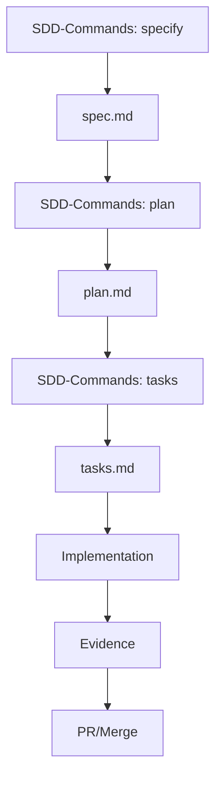

# .specify/ - SDD Meta-Documentation

## Overview

The `.specify/` directory is the authoritative source for Specification-Driven Development (SDD) framework governance, templates, and operational documentation.
It contains the meta-framework that defines how specifications, plans, and tasks are created, validated, and executed throughout the ACPLazyBridge project.

## Authority Hierarchy

```text
Constitution (memory/constitution.md)
    ↓
Lifecycle (memory/lifecycle.md)
    ↓
Commands (commands/*.md)
    ↓
Templates (templates/*.md)
```

## Directory Structure

```tree
.specify/
├── CLAUDE.md                    # Claude Code operational context
├── README.md                    # This file
├── spec-driven.md              # Core SDD philosophy and methodology
│
├── memory/                     # Constitutional governance (authoritative)
│   ├── constitution.md         # 9 articles of SDD principles
│   ├── constitution_update_checklist.md  # Sync checklist for updates
│   └── lifecycle.md           # SDD workflow lifecycle
│
├── commands/                   # SDD command implementations
│   ├── specify.md             # /specify command documentation
│   ├── plan.md               # /plan command documentation
│   ├── tasks.md              # /tasks command documentation
│   └── sdd-task.md           # /sdd-task command documentation
│
├── templates/                  # Document templates for SDD artifacts
│   ├── spec-template.md      # Specification template (WHAT/WHY)
│   ├── plan-template.md      # Implementation plan template (HOW)
│   ├── tasks-template.md     # Task breakdown template (EXECUTION)
│   └── agent-file-template.md # Agent documentation template
│
├── memory-template/           # Template versions of governance docs
│   ├── constitution.md       # Constitution template
│   └── constitution_update_checklist.md # Checklist template
│
├── commands-template/         # Template versions of command docs
│   ├── specify.md           # Specify command template
│   ├── plan.md             # Plan command template
│   └── tasks.md            # Tasks command template
│
└── scripts-template/         # Bash script templates
    └── bash/
        ├── create-new-feature.sh      # Feature initialization
        ├── setup-plan.sh              # Plan setup
        ├── check-task-prerequisites.sh # Task validation
        ├── get-feature-paths.sh      # Path resolution
        ├── update-agent-context.sh   # Memory sync
        └── common.sh                 # Shared utilities
```

## Core Components

### Constitutional Governance (`memory/`)

The heart of SDD governance, containing:

- **constitution.md** - Nine articles defining SDD principles:
    - Article I: Library-First Development
    - Article II: CLI Interface Standards
    - Article III: Test-First Development
    - Article IV: Integration Testing
    - Article V: Observability
    - Article VI: Versioning
    - Article VII: Simplicity (≤3 projects)
    - Article VIII: Anti-Abstraction
    - Article IX: Integration-First

- **lifecycle.md** - Defines the SDD workflow:
    - Specification phase (WHAT/WHY)
    - Planning phase (HOW)
    - Task generation (EXECUTION)
    - Implementation (TDD cycle)
    - Evidence collection

- **constitution_update_checklist.md** - Ensures consistency when updating the constitution, including:
    - Template synchronization
    - CLAUDE.md file updates (12 files)
    - Validation procedures

### Command System (`commands/`)

Implements the core SDD commands:

1. **`/specify`** - Initialize new feature specifications
   - Creates branch and spec directory
   - Generates spec.md from template
   - Sets up metadata and tracking

2. **`/plan`** - Create implementation plans
   - Generates plan.md from spec
   - Creates supporting documents
   - Defines technical approach

3. **`/tasks`** - Generate executable tasks
   - Derives tasks from plan
   - Orders by dependencies
   - Marks parallelizable work

4. **`/sdd-task`** - Initialize from GitHub issue
   - Fetches issue details via `gh` CLI
   - Creates worktree and branch from issue
   - Generates initial SDD artifacts
   - Links to issue tracking

### Templates (`templates/`)

Ready-to-use templates for SDD artifacts:

- **spec-template.md** - Feature specification structure
- **plan-template.md** - Implementation planning format
- **tasks-template.md** - Task breakdown structure
- **agent-file-template.md** - AI agent documentation

## SDD Workflow Integration

The complete SDD workflow follows this path: (Heman developer or AI Engineers self-select the scripts to implement the core SDD workflow)



### Phase 1: Specification (`/specify`)

```bash
# Create new feature specification
/specify "Add user authentication system"

# Or using script
./scripts/sdd/create-new-feature.sh "Add user authentication"
```

Creates:

- `specs/NNN-feature-name/spec.md`
- Feature branch: `feature/NNN-feature-name`

### Phase 2: Planning (`/plan`)

```bash
# Generate implementation plan
/plan "Use JWT tokens with Redis session store"

# Or using script
./scripts/sdd/setup-plan.sh
```

Creates:

- `specs/NNN-feature-name/plan.md`
- Supporting documents (data-model.md, contracts/, research.md)

### Phase 3: Task Generation (`/tasks`)

```bash
# Generate task list
/tasks

# Prerequisites check
./scripts/sdd/check-task-prerequisites.sh
```

Creates:

- `specs/NNN-feature-name/tasks.md`
- Ordered, executable task list

## Key Documents

### spec-driven.md

The philosophical foundation of SDD, explaining:

- Why specifications drive development
- The power inversion from code-first to spec-first
- Benefits of executable specifications

### CLAUDE.md

Operational context for Claude Code, including:

- SDD integration patterns
- Command execution details
- Template processing rules
- Evidence collection standards

### Constitution (memory/constitution.md)

The nine articles that govern all SDD development:

- Enforced through templates and scripts
- Validated by CI/CD checks
- Version controlled (currently 1.0.1)

## Quick Reference

### Common Commands

```bash
# SDD workflow commands
/specify "Feature description"    # Start new feature
/plan "Technical approach"        # Create plan
/tasks                            # Generate tasks
/sdd-task <issue-number>          # Start from GitHub issue

# Validation commands
./scripts/sdd/validate-sdd-docs.sh         # Check SDD documents
./scripts/sdd/validate-claude-md.sh        # Validate CLAUDE.md files
./scripts/ci/run-local-ci.sh              # Run all CI checks
```

### Template Locations

| Artifact | Template Path |
|----------|--------------|
| Specification | `.specify/templates/spec-template.md` |
| Plan | `.specify/templates/plan-template.md` |
| Tasks | `.specify/templates/tasks-template.md` |
| Agent Docs | `.specify/templates/agent-file-template.md` |

### Evidence Paths

- Primary: `_artifacts/{tests,logs,reports,jq}/<task>/`
- Legacy: `dev-docs/review/_artifacts/{tests,logs,reports,jq}/<task>/`

## Version Management

### Current Versions

- Constitution: 1.0.1
- Templates: Aligned with Constitution 1.0.1
- Last sync: 2025-09-17

### Update Procedures

1. **Constitution Updates**:
   - Edit `memory/constitution.md`
   - Run `constitution_update_checklist.md`
   - Update all dependent documents
   - Validate with `validate-claude-md.sh`

2. **Template Updates**:
   - Modify template in `templates/`
   - Update version in footer
   - Sync with active specs if needed

3. **Command Updates**:
   - Edit command in `commands/`
   - Update corresponding scripts
   - Test with example execution

## Related Documentation

- [Root CLAUDE.md](../CLAUDE.md) - Project-wide guidance
- [Contributing](../CONTRIBUTING.md) - Contribution guidelines
- [SDD Rules](../sdd-rules/) - Detailed SDD rules and standards
- [Scripts](../scripts/sdd/) - SDD automation scripts

## Maintenance

This directory is maintained according to:

- Constitution Article VII (Simplicity)
- Constitution Article IX (Integration-First)
- SDD lifecycle principles

Regular maintenance includes:

- Template version synchronization
- Command documentation updates
- Constitution compliance checks
- CLAUDE.md file synchronization

---

```yaml
Constitution version: 1.0.1
Document: .specify/README.md
Document version: 1.0.2
Last Updated: 2025-09-20
```
