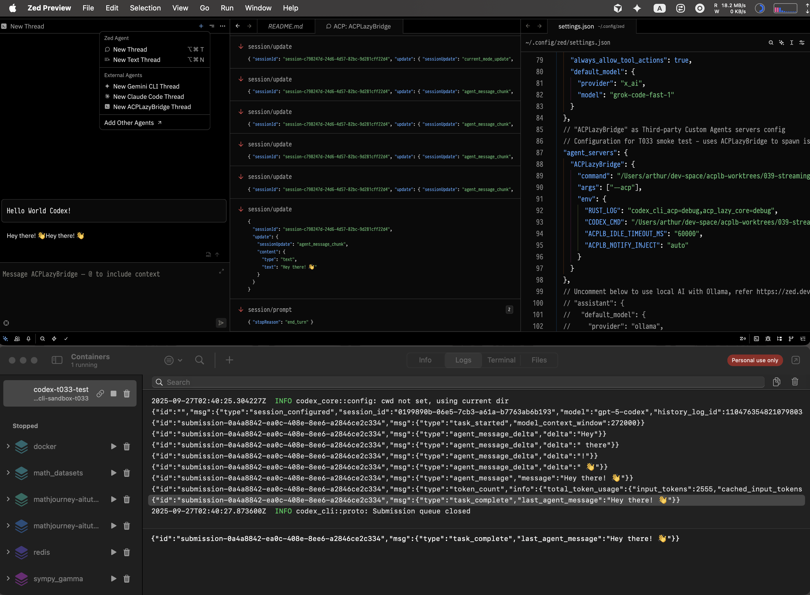

# T033 Zed Smoke Test – Results (2025-09-26)



2025-09-27T04:29:21.642354Z - 2025-09-27T04:29:21.642354Z

## Docker sandbox output

```text
2025-09-27T04:29:19.428164Z  INFO codex_core::config: cwd not set, using current dir
{"id":"","msg":{"type":"session_configured","session_id":"0199896e-bad1-7b80-be59-4253a8e0ce13","model":"gpt-5-codex","history_log_id":1104763548210798038,"history_entry_count":3,"rollout_path":"/home/node/.codex/sessions/2025/09/27/rollout-2025-09-27T04-29-19-0199896e-bad1-7b80-be59-4253a8e0ce13.jsonl"}}
{"id":"submission-b8e2f708-1ced-46b2-813a-13d26f38ceea","msg":{"type":"task_started","model_context_window":272000}}
{"id":"submission-b8e2f708-1ced-46b2-813a-13d26f38ceea","msg":{"type":"agent_message_delta","delta":"Hello"}}
{"id":"submission-b8e2f708-1ced-46b2-813a-13d26f38ceea","msg":{"type":"agent_message_delta","delta":"!"}}
{"id":"submission-b8e2f708-1ced-46b2-813a-13d26f38ceea","msg":{"type":"agent_message_delta","delta":" Great"}}
{"id":"submission-b8e2f708-1ced-46b2-813a-13d26f38ceea","msg":{"type":"agent_message_delta","delta":" to"}}
{"id":"submission-b8e2f708-1ced-46b2-813a-13d26f38ceea","msg":{"type":"agent_message_delta","delta":" be"}}
{"id":"submission-b8e2f708-1ced-46b2-813a-13d26f38ceea","msg":{"type":"agent_message_delta","delta":" working"}}
{"id":"submission-b8e2f708-1ced-46b2-813a-13d26f38ceea","msg":{"type":"agent_message_delta","delta":" with"}}
{"id":"submission-b8e2f708-1ced-46b2-813a-13d26f38ceea","msg":{"type":"agent_message_delta","delta":" you"}}
{"id":"submission-b8e2f708-1ced-46b2-813a-13d26f38ceea","msg":{"type":"agent_message_delta","delta":"—"}}
{"id":"submission-b8e2f708-1ced-46b2-813a-13d26f38ceea","msg":{"type":"agent_message_delta","delta":"what"}}
{"id":"submission-b8e2f708-1ced-46b2-813a-13d26f38ceea","msg":{"type":"agent_message_delta","delta":" can"}}
{"id":"submission-b8e2f708-1ced-46b2-813a-13d26f38ceea","msg":{"type":"agent_message_delta","delta":" I"}}
{"id":"submission-b8e2f708-1ced-46b2-813a-13d26f38ceea","msg":{"type":"agent_message_delta","delta":" help"}}
{"id":"submission-b8e2f708-1ced-46b2-813a-13d26f38ceea","msg":{"type":"agent_message_delta","delta":" you"}}
{"id":"submission-b8e2f708-1ced-46b2-813a-13d26f38ceea","msg":{"type":"agent_message_delta","delta":" build"}}
{"id":"submission-b8e2f708-1ced-46b2-813a-13d26f38ceea","msg":{"type":"agent_message_delta","delta":" today"}}
{"id":"submission-b8e2f708-1ced-46b2-813a-13d26f38ceea","msg":{"type":"agent_message_delta","delta":"?"}}
{"id":"submission-b8e2f708-1ced-46b2-813a-13d26f38ceea","msg":{"type":"agent_message","message":"Hello! Great to be working with you—what can I help you build today?"}}
{"id":"submission-b8e2f708-1ced-46b2-813a-13d26f38ceea","msg":{"type":"token_count","info":{"total_token_usage":{"input_tokens":2555,"cached_input_tokens":2432,"output_tokens":23,"reasoning_output_tokens":0,"total_tokens":2578},"last_token_usage":{"input_tokens":2555,"cached_input_tokens":2432,"output_tokens":23,"reasoning_output_tokens":0,"total_tokens":2578},"model_context_window":272000},"rate_limits":null}}
{"id":"submission-b8e2f708-1ced-46b2-813a-13d26f38ceea","msg":{"type":"task_complete","last_agent_message":"Hello! Great to be working with you—what can I help you build today?"}}
2025-09-27T04:29:21.642354Z  INFO codex_cli::proto: Submission queue closed
```

## Zed ACP debug panel log excerpt

```json
{
  "protocolVersion": 1,
  "clientCapabilities": {
    "fs": {
      "readTextFile": true,
      "writeTextFile": true
    },
    "terminal": true
  }
}

{
  "protocolVersion": 1,
  "agentCapabilities": {
    "loadSession": false,
    "promptCapabilities": {
      "image": false,
      "audio": false,
      "embeddedContext": false
    },
    "mcpCapabilities": {
      "http": false,
      "sse": false
    }
  },
  "authMethods": []
}

{
  "cwd": "/Users/arthur/dev-space/subscriptions",
  "mcpServers": []
}

{
  "sessionId": "session-e56b0ff2-2457-4c12-baab-09db75c70013"
}

{
  "sessionId": "session-e56b0ff2-2457-4c12-baab-09db75c70013",
  "prompt": [
    {
      "type": "text",
      "text": "hello world Codex!"
    }
  ]
}

{
  "sessionId": "session-e56b0ff2-2457-4c12-baab-09db75c70013",
  "update": {
    "sessionUpdate": "current_mode_update",
    "currentModeId": "gpt-5-codex"
  }
}

{
  "sessionId": "session-e56b0ff2-2457-4c12-baab-09db75c70013",
  "update": {
    "sessionUpdate": "agent_message_chunk",
    "content": {
      "type": "text",
      "text": "Hello"
    }
  }
}

{
  "sessionId": "session-e56b0ff2-2457-4c12-baab-09db75c70013",
  "update": {
    "sessionUpdate": "agent_message_chunk",
    "content": {
      "type": "text",
      "text": "!"
    }
  }
}

// agent_message_chunk chunk messages ...

{
  "sessionId": "session-e56b0ff2-2457-4c12-baab-09db75c70013",
  "update": {
    "sessionUpdate": "agent_message_chunk",
    "content": {
      "type": "text",
      "text": " today"
    }
  }
}

{
  "sessionId": "session-e56b0ff2-2457-4c12-baab-09db75c70013",
  "update": {
    "sessionUpdate": "agent_message_chunk",
    "content": {
      "type": "text",
      "text": "?"
    }
  }
}

{
  "sessionId": "session-e56b0ff2-2457-4c12-baab-09db75c70013",
  "update": {
    "sessionUpdate": "agent_message_chunk",
    "content": {
      "type": "text",
      "text": "Hello! Great to be working with you—what can I help you build today?"
    }
  }
}

{
  "stopReason": "end_turn"
}
```

> _Screenshot stored separately as `T033-smoke-test.png` under `_artifacts/039-streaming-alignment/tests/`. Capture shows Codex CLI sandbox, Docker logs, and Zed Agent Panel UI and ACP debug panel log window streaming agent deltas._
