# GitHub Projects Quick Start Guide

**Quick Reference**: Set up and use GitHub Projects for ACPLazyBridge Milestone 0.1.0

## 🚀 Quick Setup (5 Minutes)

### Step 1: Create Project
Go to: https://github.com/lwyBZss8924d/ACPLazyBridge/projects/new

```
Name: Milestone 0.1.0 - Core Runtime & Codex MVP
Template: Board
Description: Tracking first release - Codex CLI ACP adapter with MCP bridge
```

### Step 2: Configure Columns
Default columns are perfect:
- 📋 **Todo** (rename to "Backlog")
- 🔄 **In Progress**
- ✅ **Done**

Add one more:
- 🧪 **In Review**

### Step 3: Add Custom Fields
Settings → Fields → Add field:

| Field | Type | Options |
|-------|------|---------|
| Priority | Select | 🔴 Critical, 🟠 High, 🟡 Medium, 🟢 Low |
| Component | Select | core-runtime, codex-adapter, testing, docs |
| Effort | Select | S (1-2d), M (3-5d), L (1-2w), XL (2+w) |
| SDD Phase | Select | Research, Specify, Plan, Tasks, Implementation, Validation |

### Step 4: Add Issue #52
In project, click "+" → Search "52" → Add

Set fields:
- Status: 🔄 In Progress
- Priority: 🔴 Critical
- Component: codex-adapter
- Effort: L (3 weeks)
- SDD Phase: Research

### Step 5: Enable Automations
Settings → Workflows → Enable:
- ✅ Item added to project
- ✅ Item closed
- ✅ Pull request merged
- ✅ Auto-add to project (set label: "M1" or "milestone:0.1.0")

## 📊 Daily Workflow

### For Developers

**Starting work on an issue:**
```bash
1. Move card to "In Progress"
2. Run: /sdd-task <issue-number>
3. Create branch in generated worktree
4. Implement following specs/NNN-*/tasks.md
```

**Opening PR:**
```bash
1. Create PR linking to issue (#52)
2. Card auto-moves to "In Review"
3. Add evidence links in PR description
```

**After merge:**
```bash
1. Close issue
2. Card auto-moves to "Done"
3. Update project with completion date
```

### For Project Tracking

**View progress:**
- **Kanban**: https://github.com/lwyBZss8924d/ACPLazyBridge/projects/1
- **Table**: Switch view → Table
- **Roadmap**: Switch view → Roadmap

**Filter by priority:**
```
Priority = Critical
Component = codex-adapter
```

**Check velocity:**
```
View: Insights → Burndown chart
Group by: Week
```

## 🎯 Current Status (2025-09-30)

### Milestone 0.1.0 Progress

| Component | Issues | Completed | In Progress |
|-----------|--------|-----------|-------------|
| core-runtime | 2 | ✅ 2 (100%) | - |
| codex-adapter | 1 | - | 🔄 Issue #52 |
| testing | 0 | - | - |
| docs | 0 | - | - |
| **Total** | **3** | **2 (67%)** | **1 (33%)** |

### Critical Path

```mermaid
graph LR
    A[✅ Issue #44<br/>Runtime Adoption] --> B[🔄 Issue #52<br/>Protocol Alignment]
    B --> C[📋 Zed Integration<br/>Validation]
    C --> D[📋 Documentation<br/>Polish]
    D --> E[🎉 Release<br/>0.1.0]

    style A fill:#90EE90
    style B fill:#FFD700
    style C fill:#D3D3D3
    style D fill:#D3D3D3
    style E fill:#87CEEB
```



### Issue #52 Breakdown

**Overall Progress**: Research ✅ → Specify ⏳

| Phase | Status | Deliverables |
|-------|--------|--------------|
| 1. Research | ✅ Done | 8,600+ lines analysis in `dev-docs/_requirements/040-*` |
| 2. Specify | ⏳ Next | Run `/sdd-task 52` → generate `specs/040-*/spec.md` |
| 3. Plan | 📋 Queue | Generate `plan.md` with technical design |
| 4. Tasks | 📋 Queue | Generate `tasks.md` with implementation checklist |
| 5. Implementation | 📋 Queue | Week 1: Bridge, Week 2: Events, Week 3: Testing |
| 6. Validation | 📋 Queue | CI + Evidence collection |

**Effort Breakdown**:
- Bridge Infrastructure: 5-6 days (McpBridge + acp_mcp_server)
- Event Coverage: 5-6 days (14 missing events + slash commands)
- Testing & Docs: 4-5 days (tests + evidence + documentation)
- **Total**: ~3 weeks

## 🔗 Quick Links

### Project URLs
- **Project Home**: https://github.com/lwyBZss8924d/ACPLazyBridge/projects/1 _(to be created)_
- **Milestone**: https://github.com/lwyBZss8924d/ACPLazyBridge/milestone/1
- **Issue #52**: https://github.com/lwyBZss8924d/ACPLazyBridge/issues/52

### Documentation
- [Roadmap](./Roadmap.md) - Strategic timeline
- [GitHub Projects Setup](./github-projects-setup.md) - Detailed guide
- [Issue #52 Draft](../dev-docs/_issues_drafts/closed/#52-codex-protocol-alignment-mvp.md) - Full spec
- [Requirements Package](./040-codex-protocol-alignment-mvp/) - Research materials

### SDD Resources
- [Constitution](../.specify/memory/constitution.md) - Governance
- [Lifecycle](../.specify/memory/lifecycle.md) - Workflow
- [SDD Rules](../sdd-rules/rules/README.md) - All rules

## 🎓 Tips & Best Practices

### ✅ Do's
- **Update status regularly**: Move cards as work progresses
- **Link evidence**: Add artifact links to issues when complete
- **Use SDD workflow**: Always run `/sdd-task` before starting
- **Track blockers**: Add comments when blocked, update status
- **Close with evidence**: Include links to `_artifacts/` when closing

### ❌ Don'ts
- **Don't skip phases**: Research → Specify → Plan → Tasks → Implement
- **Don't commit to main**: Always use worktrees for development
- **Don't forget tests**: Test-first per Constitution Article III
- **Don't skip CI**: Run `scripts/ci/run-local-ci.sh` before PR
- **Don't ignore hooks**: Validate with `.claude/hooks/` scripts

## 📞 Getting Help

**Issues with project setup?**
- Read: [github-projects-setup.md](./github-projects-setup.md)
- GitHub Docs: https://docs.github.com/en/issues/planning-and-tracking-with-projects

**Issues with SDD workflow?**
- Check: `.specify/memory/lifecycle.md`
- Run: `scripts/sdd/validate-sdd-docs.sh`

**Issues with authentication?**
- Refresh: `gh auth refresh -h github.com -s project`
- Requires: project, read:project, write:org scopes

---

**Last Updated**: 2025-09-30T14:59:57Z
**Status**: Ready for manual project creation
**Next Action**: Create project via GitHub web UI using Step 1-5 above