# GitHub Projects Setup for ACPLazyBridge

Created: 2025-09-30T14:59:57Z

## Overview

This document outlines the GitHub Projects structure for managing ACPLazyBridge milestones, based on the [Roadmap](./Roadmap.md) and current work on [Issue #52](https://github.com/lwyBZss8924d/ACPLazyBridge/issues/52).

## Project Structure

### Project 1: Milestone 0.1.0 - Core Runtime & Codex MVP

**Purpose**: Track completion of the first release, focusing on Codex CLI ACP adapter with full protocol alignment.

**Timeline**: Q3-1 2025 (Target: October 2025)

**Status Fields**:
- 📋 **Backlog**: Issues identified but not yet started
- 🔄 **In Progress**: Currently being worked on
- 🧪 **In Review**: Implementation complete, under review
- ✅ **Done**: Merged and validated

**Priority Levels**:
- 🔴 **Critical**: Blocking milestone completion
- 🟠 **High**: Important for MVP functionality
- 🟡 **Medium**: Enhances quality but not blocking
- 🟢 **Low**: Nice-to-have improvements

**Custom Fields**:
- **Milestone**: 0.1.0
- **Component**: core-runtime | codex-adapter | testing | docs
- **Effort**: S (1-2 days) | M (3-5 days) | L (1-2 weeks) | XL (2+ weeks)
- **SDD Phase**: Research | Specify | Plan | Tasks | Implementation | Validation

### Issues for Milestone 0.1.0

Based on Roadmap analysis:

#### ✅ Completed Issues
1. **Issue #44** (or earlier): Runtime adoption with AgentSideConnection
   - Status: ✅ Done
   - SDD: `specs/038-adopt-acp-runtime/`
   - Evidence: `_artifacts/038-adopt-acp-runtime/`

2. **Issue #45**: Streaming alignment with SessionNotification
   - Status: ✅ Done
   - SDD: `specs/039-streaming-alignment-session-notifications/`

#### 🔄 In Progress
3. **Issue #52**: Codex Protocol Alignment MVP ⭐ **CURRENT**
   - Status: 🔄 In Progress (Research Complete)
   - Priority: 🔴 Critical
   - Component: codex-adapter
   - Effort: L (3 weeks)
   - SDD Phase: Research → Ready for `/specify`
   - Requirements: `dev-docs/_requirements/040-codex-protocol-alignment-mvp/`
   - Deliverables:
     - MCP-to-ACP bridge (McpBridge + acp_mcp_server)
     - 14 missing event handlers (100% coverage target)
     - Slash command support
     - Evidence in `_artifacts/040-codex-protocol-alignment-mvp/`

#### 📋 Backlog (Future Issues)
4. **Issue #XX**: End-to-end Zed integration validation
   - Status: 📋 Backlog
   - Priority: 🟠 High
   - Component: testing
   - Effort: M
   - Dependencies: Issue #52

5. **Issue #XX**: Performance benchmarking and optimization
   - Status: 📋 Backlog
   - Priority: 🟡 Medium
   - Component: core-runtime
   - Effort: M

6. **Issue #XX**: Documentation polish and quickstart guides
   - Status: 📋 Backlog
   - Priority: 🟡 Medium
   - Component: docs
   - Effort: S

### Project Views

#### 1. Kanban View (Default)
Columns: Backlog | In Progress | In Review | Done

Grouping: By Status
Sorting: By Priority (Critical → Low)

#### 2. Table View
Columns: Issue | Title | Status | Priority | Milestone | Component | Effort | Assignee
Filters: Show only Milestone 0.1.0

#### 3. Roadmap View
Timeline visualization by Effort and dependencies

#### 4. Component View
Group by: Component
Shows distribution across core-runtime, codex-adapter, testing, docs

## Automation Rules

### Rule 1: Auto-add to Project
**Trigger**: Issue labeled with `milestone:0.1.0` or `M1`
**Action**: Add to "Milestone 0.1.0" project in Backlog

### Rule 2: Move to In Progress
**Trigger**: Issue status changes to "In Progress" OR has linked PR
**Action**: Move to "In Progress" column

### Rule 3: Move to In Review
**Trigger**: PR opened and linked to issue
**Action**: Move to "In Review" column

### Rule 4: Move to Done
**Trigger**: Issue closed as completed
**Action**: Move to "Done" column

### Rule 5: Block on Dependencies
**Trigger**: Issue has "blocked by" relationship
**Action**: Add 🚫 indicator in card

## Integration with SDD Workflow

### Issue → Spec → Plan → Tasks Flow


### Project Board Workflow

```mermaid
graph LR
    A[📋 Backlog] -->|Start Work| B[🔄 In Progress]
    B -->|Create PR| C[🧪 In Review]
    C -->|Merge| D[✅ Done]
    C -->|Changes Requested| B
```



## Manual Setup Instructions

Since GitHub CLI requires interactive auth for project permissions, follow these steps:

### Step 1: Create Project via Web UI
1. Go to: https://github.com/users/lwyBZss8924d/projects
2. Click "New project" → "Board"
3. Name: "Milestone 0.1.0 - Core Runtime & Codex MVP"
4. Description: "Tracking completion of first release: Codex CLI ACP adapter with MCP bridge and full protocol alignment"

### Step 2: Configure Custom Fields
Add these custom fields via Project Settings:

1. **Priority** (Single select)
   - Options: Critical, High, Medium, Low
   - Colors: Red, Orange, Yellow, Green

2. **Component** (Single select)
   - Options: core-runtime, codex-adapter, testing, docs

3. **Effort** (Single select)
   - Options: S (1-2 days), M (3-5 days), L (1-2 weeks), XL (2+ weeks)

4. **SDD Phase** (Single select)
   - Options: Research, Specify, Plan, Tasks, Implementation, Validation

### Step 3: Add Issues to Project
1. Add Issue #52 (Codex Protocol Alignment MVP)
   - Status: In Progress
   - Priority: Critical
   - Component: codex-adapter
   - Effort: L
   - SDD Phase: Research (ready for Specify)

2. Create and add placeholder issues for remaining Milestone 0.1.0 work

### Step 4: Configure Views
Create these views:

1. **Kanban** (default)
   - Group by: Status
   - Sort by: Priority

2. **Table**
   - Show all fields
   - Filter: Milestone = 0.1.0

3. **Roadmap**
   - Timeline view by Effort

### Step 5: Set Up Automations
Enable these built-in workflows:
- Auto-add items with label
- Auto-archive items
- Item added to project
- Pull request merged

## Project Health Metrics

Track these KPIs:

- **Velocity**: Issues completed per week
- **Cycle Time**: Time from "In Progress" to "Done"
- **Blocked Time**: Time issues spend in blocked state
- **Coverage**: % of milestone scope covered by issues

## Future Projects

### Project 2: Milestone 0.2.0 - Multi-Agent Runtime
To be created after 0.1.0 completion

### Project 3: Milestone 0.3.0 - Cross-Editor Clients
To be created in Q4 2025

### Project 4: Milestone 0.4.0 - Ecosystem Hardening
To be created in Q4 2025

## References

- [Roadmap.md](./Roadmap.md) - Strategic timeline and milestone definitions
- [Issue #52](https://github.com/lwyBZss8924d/ACPLazyBridge/issues/52) - Current critical work
- [SDD Constitution](./../.specify/memory/constitution.md) - Governance framework
- [GitHub Projects Docs](https://docs.github.com/en/issues/planning-and-tracking-with-projects)

## Commands Reference

```bash
# View project (after auth refresh)
gh project list --owner lwyBZss8924d

# View project items
gh project item-list <PROJECT_NUMBER> --owner lwyBZss8924d

# Add issue to project
gh project item-add <PROJECT_NUMBER> --owner lwyBZss8924d --url https://github.com/lwyBZss8924d/ACPLazyBridge/issues/52

# Refresh auth with project permissions (interactive)
gh auth refresh -h github.com -s project,read:project,write:org
```

## Next Steps

1. ✅ Complete Issue #52 requirements gathering (DONE)
2. ⏳ Create GitHub Project manually via Web UI
3. ⏳ Run `/sdd-task 52` to initialize SDD workflow
4. ⏳ Track implementation progress on project board
5. ⏳ Update project with evidence artifacts as work completes

---

**Document Status**: Ready for manual project creation
**Last Updated**: 2025-09-30T14:59:57Z
**Owner**: AI-Engineer (Claude)