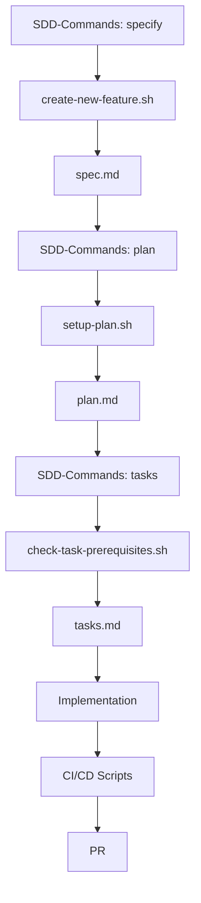

# Scripts Directory

Automation scripts for Specification-Driven Development (SDD), CI/CD, and code quality analysis.

## Overview

This directory contains all automation scripts that power the ACPLazyBridge development workflow. Scripts are organized into three main categories:

- **SDD Scripts** (`sdd/`) - Core SDD workflow automation
- **CI Scripts** (`ci/`) - Continuous Integration and validation
- **AST-grep Scripts** (`ast-grep/`) - Code analysis and quality checks

## Quick Start

### Common Workflows

```bash
# Create a new feature (SDD workflow)
./scripts/sdd/create-new-feature.sh "Add chat system"

# Run full local CI suite before PR
./scripts/ci/run-local-ci.sh

# Check code quality with AST-grep
./scripts/ast-grep/sg-scan.sh

# Validate SDD documents
./scripts/sdd/validate-sdd-docs.sh
```

## Directory Structure

```tree
scripts/
├── sdd/                 # SDD workflow automation (17 scripts)
│   ├── create-new-feature.sh      # Initialize features
│   ├── setup-plan.sh              # Create plans
│   ├── check-task-prerequisites.sh # Validate tasks
│   ├── validate-sdd-docs.sh      # SDD document validation
│   ├── check_language.sh          # Language policy
│   ├── run_semantic_checks.sh     # Link validation
│   ├── check-markdown.sh          # Markdown checks
│   ├── fix-markdown.sh            # Auto-fix markdown
│   ├── lint_docs.sh              # Doc linting
│   ├── get-feature-paths.sh      # Path utilities
│   ├── update-agent-context.sh   # Memory sync
│   ├── validate-metadata.sh      # Validate YAML metadata
│   ├── query-metadata.sh         # Query docs by metadata
│   ├── check-sdd-consistency.sh  # Check SDD consistency
│   ├── migrate-to-yaml-metadata.sh # Migrate metadata format
│   ├── common.sh                 # Shared functions
│   └── lib/
│       └── metadata-utils.sh     # Metadata processing utilities
├── ci/                  # CI/CD automation (4 scripts)
│   ├── run-local-ci.sh           # Main CI orchestrator
│   ├── run-sdd-structure-lint.sh # SDD validation
│   ├── check-language-policy.sh  # English enforcement
│   └── run-markdown-style.sh     # Markdown linting
└── ast-grep/           # Code analysis (6 scripts)
    ├── sg-scan.sh                 # Full codebase scan
    ├── sg-scan-file.sh           # Single file scan
    ├── sg-baseline-acp-rust-dbg.sh    # Find dbg! macros
    ├── sg-baseline-acp-rust-no-unwrap.sh # Find unwrap()
    ├── sg-baseline-acp-rust-todo.sh      # Find TODOs
    └── sg-fix.sh                 # Apply auto-fixes
```

## Complete Script Reference

### SDD Workflow Scripts (`sdd/`)

| Script | Purpose | Usage |
|--------|---------|-------|
| `create-new-feature.sh` | Initialize new feature with spec, branch, and directory | `./scripts/sdd/create-new-feature.sh "feature description"` |
| `setup-plan.sh` | Bootstrap implementation plan structure | `./scripts/sdd/setup-plan.sh [--json]` |
| `check-task-prerequisites.sh` | Validate task prerequisites exist | `./scripts/sdd/check-task-prerequisites.sh [--json]` |
| `validate-sdd-docs.sh` | Validate SDD documents against templates | `./scripts/sdd/validate-sdd-docs.sh` |
| `check_language.sh` | Enforce English-only in normative docs | `./scripts/sdd/check_language.sh` |
| `run_semantic_checks.sh` | Validate cross-references and links | `./scripts/sdd/run_semantic_checks.sh` |
| `check-markdown.sh` | Check markdown file quality | `./scripts/sdd/check-markdown.sh` |
| `fix-markdown.sh` | Auto-fix markdown linting issues | `./scripts/sdd/fix-markdown.sh` |
| `lint_docs.sh` | Comprehensive documentation linting | `./scripts/sdd/lint_docs.sh` |
| `get-feature-paths.sh` | Get current feature directory paths | `./scripts/sdd/get-feature-paths.sh` |
| `update-agent-context.sh` | Update agent memory files | `./scripts/sdd/update-agent-context.sh` |
| `validate-metadata.sh` | Validate YAML metadata in SDD documents | `./scripts/sdd/validate-metadata.sh [--file FILE] [--format json]` |
| `query-metadata.sh` | Query documents by metadata fields | `./scripts/sdd/query-metadata.sh --type claude-memory` |
| `check-sdd-consistency.sh` | Check SDD documentation consistency | `./scripts/sdd/check-sdd-consistency.sh [--verbose]` |
| `migrate-to-yaml-metadata.sh` | Migrate metadata to YAML format | `./scripts/sdd/migrate-to-yaml-metadata.sh [--dry-run]` |
| `common.sh` | Shared utilities (sourced by others) | `source scripts/sdd/common.sh` |
| `lib/metadata-utils.sh` | Metadata processing utilities | `source scripts/sdd/lib/metadata-utils.sh` |

### CI/CD Scripts (`ci/`)

| Script | Purpose | Usage |
|--------|---------|-------|
| `run-local-ci.sh` | Run complete CI suite locally | `./scripts/ci/run-local-ci.sh` |
| `run-sdd-structure-lint.sh` | Validate SDD compliance | `./scripts/ci/run-sdd-structure-lint.sh` |
| `check-language-policy.sh` | Check English-only policy | `./scripts/ci/check-language-policy.sh` |
| `run-markdown-style.sh` | Markdown style validation | `./scripts/ci/run-markdown-style.sh` |

### Code Analysis Scripts (`ast-grep/`)

| Script | Purpose | Usage |
|--------|---------|-------|
| `sg-scan.sh` | Run all AST-grep rules | `./scripts/ast-grep/sg-scan.sh` |
| `sg-scan-file.sh` | Scan specific file | `./scripts/ast-grep/sg-scan-file.sh <file>` |
| `sg-baseline-acp-rust-dbg.sh` | Find Rust dbg! macros | `./scripts/ast-grep/sg-baseline-acp-rust-dbg.sh` |
| `sg-baseline-acp-rust-no-unwrap.sh` | Find Rust unwrap() calls | `./scripts/ast-grep/sg-baseline-acp-rust-no-unwrap.sh` |
| `sg-baseline-acp-rust-todo.sh` | Find TODO comments | `./scripts/ast-grep/sg-baseline-acp-rust-todo.sh` |
| `sg-fix.sh` | Apply automatic fixes | `./scripts/ast-grep/sg-fix.sh` |

## SDD Workflow Integration

Heman developer or AI Engineers self-select the scripts to implement the core SDD workflow:



### 1. Feature Initialization (`/specify`)

```bash
# Creates branch, spec directory, and template
./scripts/sdd/create-new-feature.sh --json "Chat system feature"
```

Returns JSON:

```json
{
  "BRANCH_NAME": "feature/001-chat-system",
  "SPEC_FILE": "/path/to/specs/001-chat-system/spec.md",
  "FEATURE_NUMBER": "001"
}
```

### 2. Plan Setup (`/plan`)

```bash
# Creates plan structure and templates
./scripts/sdd/setup-plan.sh --json
```

Returns JSON:

```json
{
  "FEATURE_SPEC": "/path/to/specs/001-chat-system/spec.md",
  "IMPL_PLAN": "/path/to/specs/001-chat-system/plan.md",
  "SPECS_DIR": "/path/to/specs/001-chat-system",
  "BRANCH": "feature/001-chat-system"
}
```

### 3. Task Generation (`/tasks`)

```bash
# Validates prerequisites for task generation
./scripts/sdd/check-task-prerequisites.sh --json
```

Returns JSON with available documents for task derivation.

## CI/CD Integration

### Local CI Validation

Run the complete CI suite before pushing:

```bash
./scripts/ci/run-local-ci.sh
```

This executes:

1. Rust formatting check (`cargo fmt`)
2. Clippy linting (`cargo clippy`)
3. Test execution (`cargo test`)
4. SDD structure validation
5. Language policy check
6. Markdown style check
7. Semantic validation

### GitHub Actions

The CI scripts are designed to work both locally and in GitHub Actions:

```yaml
- name: Run CI checks
  run: |
    ./scripts/ci/run-local-ci.sh
```

## Metadata Management

### Overview

The metadata management scripts provide tools for validating, querying, and maintaining consistent YAML metadata across all SDD documents.

### Metadata Validation

```bash
# Validate single file
./scripts/sdd/validate-metadata.sh --file CLAUDE.md --verbose

# Validate all SDD documents
./scripts/sdd/validate-metadata.sh

# Generate JSON report
./scripts/sdd/validate-metadata.sh --format json > validation-report.json

# Check constitution version consistency
./scripts/sdd/validate-metadata.sh --check-consistency --strict
```

### Metadata Queries

```bash
# Find all Claude memory files
./scripts/sdd/query-metadata.sh --type claude-memory

# Find outdated documents (not updated in 30 days)
./scripts/sdd/query-metadata.sh --outdated 30

# Find documents with old constitution version
./scripts/sdd/query-metadata.sh --constitution-version 1.0.0

# Get all documents sorted by date
./scripts/sdd/query-metadata.sh --all --sort date --format json
```

### Consistency Checking

```bash
# Full consistency check with details
./scripts/sdd/check-sdd-consistency.sh --verbose

# Generate JSON consistency report
./scripts/sdd/check-sdd-consistency.sh --format json > consistency-report.json

# Check without dependency validation (faster)
./scripts/sdd/check-sdd-consistency.sh --no-dependencies
```

### Metadata Migration

```bash
# Dry run to preview changes
./scripts/sdd/migrate-to-yaml-metadata.sh --dry-run

# Migrate all files
./scripts/sdd/migrate-to-yaml-metadata.sh

# Migrate specific file
./scripts/sdd/migrate-to-yaml-metadata.sh --file sdd-rules/AGENTS.md
```

## Code Quality with AST-grep

### Configuration

AST-grep rules are defined in `sgconfig.yml` at the repository root.

### Running Scans

```bash
# Full scan with all rules
./scripts/ast-grep/sg-scan.sh

# Specific checks
./scripts/ast-grep/sg-baseline-acp-rust-no-unwrap.sh  # unwrap() usage
./scripts/ast-grep/sg-baseline-acp-rust-dbg.sh        # dbg! macros
./scripts/ast-grep/sg-baseline-acp-rust-todo.sh       # TODO comments

# Single file analysis
./scripts/ast-grep/sg-scan-file.sh src/main.rs
```

### Evidence Collection

```bash
# Primary location (new)
ast-grep scan 2>&1 | tee _artifacts/reports/<task>/ast_grep_$(date +%Y%m%d).log

# Legacy location
ast-grep scan 2>&1 | tee _artifacts/reports/legacy/<task>/ast_grep_$(date +%Y%m%d).log
```

## Development Guidelines

### Script Standards

1. **Shebang**: Use `#!/usr/bin/env bash` for portability
2. **Error Handling**: Include `set -e` for fail-fast behavior
3. **JSON Output**: Support `--json` flag for tool integration
4. **Documentation**: Include usage comments at the top
5. **Exit Codes**: Follow standard conventions (0=success, 1-255=errors)

### Adding New Scripts

1. Choose appropriate category directory (`sdd/`, `ci/`, or `ast-grep/`)
2. Follow naming convention: `kebab-case.sh` or `snake_case.py`
3. Include header documentation
4. Support JSON output where applicable
5. Update this README with the new script

### Environment Variables

| Variable | Purpose | Default |
|----------|---------|---------|
| `REPO_ROOT` | Repository root path | Auto-detected |
| `SKIP_TESTS` | Skip test execution in CI | `false` |
| `VERBOSE` | Enable verbose output | `false` |
| `CI` | Running in CI environment | `false` |

## Constitutional Compliance

Scripts enforce SDD constitutional principles:

- **Article III (Test-First)**: Scripts support RED→GREEN→REFACTOR workflow
- **Article VII (Simplicity)**: Each script has a single, clear purpose
- **Article IX (Integration-First)**: Validation of contracts before implementation

## Troubleshooting

### Common Issues

#### Script Not Executable

```bash
chmod +x scripts/**/*.sh
```

#### Path Resolution Issues

```bash
# Always run from repository root
cd $(git rev-parse --show-toplevel)
./scripts/sdd/create-new-feature.sh "feature"
```

#### Missing Dependencies

```bash
# Check required tools
command -v cargo || echo "Install Rust"
command -v jq || echo "Install jq"
command -v ast-grep || echo "Install ast-grep"
command -v python3 || echo "Install Python 3"
```

#### JSON Parsing Errors

```bash
# Validate JSON output
./scripts/sdd/setup-plan.sh --json | jq .
```

## Quick Reference

### Essential Commands

```bash
# SDD Workflow
./scripts/sdd/create-new-feature.sh "feature"  # Start new feature
./scripts/sdd/setup-plan.sh --json            # Create plan
./scripts/sdd/check-task-prerequisites.sh     # Validate for tasks

# Validation
./scripts/ci/run-local-ci.sh                  # Full CI suite
./scripts/sdd/validate-sdd-docs.sh            # SDD documents
./scripts/ast-grep/sg-scan.sh                 # Code analysis

# Fixes
./scripts/sdd/fix-markdown.sh                 # Fix markdown
./scripts/ast-grep/sg-fix.sh                  # Fix code issues
```

### Exit Codes

| Code | Meaning |
|------|---------|
| 0 | Success |
| 1 | General error |
| 2 | Missing dependencies |
| 3 | Invalid arguments |
| 4 | SDD validation failure |
| 5 | Quality gate failure |

## Related Documentation

- [CLAUDE.md](./CLAUDE.md) - AI agent guidance for scripts
- [SDD Constitution](../.specify/memory/constitution.md) - Core principles
- [SDD Commands](../.specify/commands/) - Command specifications
- [Contributing](../CONTRIBUTING.md) - Contribution guidelines

---

```yaml
Constitution version: 1.0.1
Document: scripts/README.md
Document version: 1.0.1
Last Updated: 2025-09-17
```
