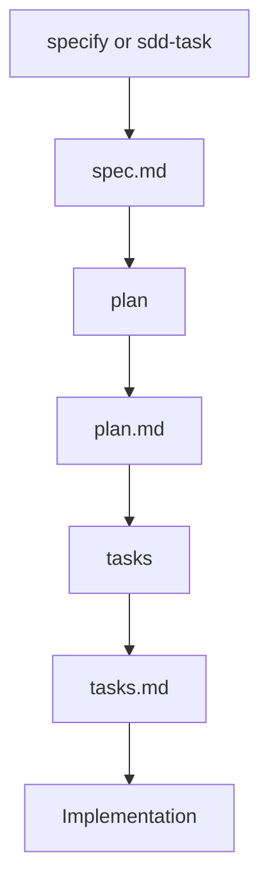

# SDD Commands Documentation

This directory documents the SDD workflow commands used in the ACPLazyBridge project.

## Command Implementations

The actual command implementations are located in `.specify/commands/`:

- **`/specify`** - Creates feature specifications from natural language descriptions
- **`/plan`** - Generates implementation plans from specifications
- **`/tasks`** - Creates executable task lists from plans
- **`/sdd-task`** - Initializes SDD task directly from GitHub issue

## Command Workflow



## Command Details

### /specify Command

**Location**: `.specify/commands/specify.md`
**Script**: `scripts/sdd/create-new-feature.sh`
**Template**: `.specify/templates/spec-template.md`

Creates a new feature specification by:

1. Creating a numbered feature branch
2. Setting up specs directory structure
3. Generating spec.md from template
4. Focusing on WHAT and WHY (not HOW)

### /plan Command

**Location**: `.specify/commands/plan.md`
**Script**: `scripts/sdd/setup-plan.sh`
**Template**: `.specify/templates/plan-template.md`

Generates implementation plan by:

1. Reading the feature specification
2. Checking constitutional gates
3. Creating technical design artifacts
4. Generating supporting documents (data-model.md, contracts/, research.md)

### /tasks Command

**Location**: `.specify/commands/tasks.md`
**Script**: `scripts/sdd/check-task-prerequisites.sh`
**Template**: `.specify/templates/tasks-template.md`

Creates executable tasks by:

1. Analyzing available design documents
2. Generating atomic, testable tasks
3. Ordering by dependencies
4. Marking parallelizable tasks with [P]

### /sdd-task Command

**Location**: `.specify/commands/sdd-task.md`
**Script**: Uses `gh` CLI directly
**Template**: Leverages all SDD templates

Initializes SDD workflow from GitHub issue by:

1. Fetching issue details via GitHub CLI
2. Determining branch type from issue labels
3. Creating appropriate worktree and branch
4. Triggering full SDD workflow (/specify → /plan → /tasks)
5. Linking all artifacts to the GitHub issue

## Constitutional Compliance

All commands enforce the ACPLazyBridge SDD Constitution (v1.0.1):

- **Article I**: Library-First approach
- **Article II**: CLI Interface requirements
- **Article III**: Test-First development (TDD)
- **Article VII**: Simplicity (≤3 projects)
- **Article VIII**: Anti-Abstraction
- **Article IX**: Integration-First

## Script Integration

Supporting scripts in `scripts/sdd/`:

| Script | Purpose | Called By |
|--------|---------|-----------|
| `create-new-feature.sh` | Create branch and spec structure | /specify |
| `setup-plan.sh` | Initialize plan structure | /plan |
| `check-task-prerequisites.sh` | Validate prerequisites | /tasks |
| `common.sh` | Shared utilities | All scripts |
| `get-feature-paths.sh` | Path resolution | All scripts |
| `gh issue view` | Fetch issue details | /sdd-task |

## Usage Examples

```bash
# Start a new feature
/specify "Real-time chat system with message history"

# Create implementation plan
/plan "WebSocket for real-time, PostgreSQL for history"

# Generate tasks
/tasks

# Results in:
# - Branch: 001-real-time-chat
# - specs/001-real-time-chat/spec.md
# - specs/001-real-time-chat/plan.md
# - specs/001-real-time-chat/tasks.md

# Start from existing GitHub issue
/sdd-task 28
# or
/sdd-task https://github.com/lwyBZss8924d/ACPLazyBridge/issues/28

# Results in:
# - Branch: docs/028-ci-add-docs-style
# - specs/028-ci-add-docs-style/spec.md
# - specs/028-ci-add-docs-style/plan.md
# - specs/028-ci-add-docs-style/tasks.md
```

## Quality Gates

Commands enforce quality gates:

1. **Specification Phase**: Testable requirements, clear acceptance criteria
2. **Planning Phase**: Constitutional gate checks, risk assessment
3. **Task Phase**: TDD ordering, dependency management

## References

- Constitution: `.specify/memory/constitution.md`
- Templates: `.specify/templates/`
- Scripts: `scripts/sdd/`
- Rules: `sdd-rules/rules/`

---

```yaml
Constitution version: 1.0.1
Document: sdd-rules/commands/README.md
Document version: 1.0.2
Last Updated: 2025-09-20
```
