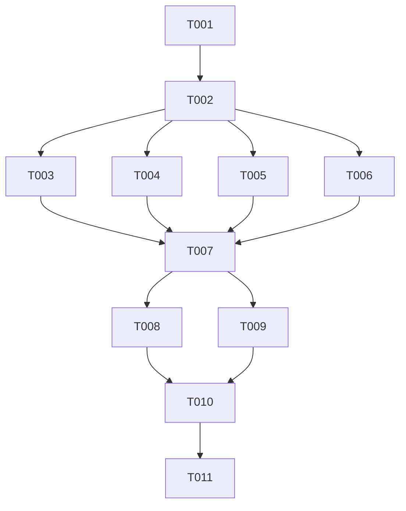

# Tasks: Align Issue Templates with SDD Constitution v1.0.1

```yaml
Issue-URI: https://github.com/lwyBZss8924d/ACPLazyBridge/issues/29
Spec-URI: https://github.com/lwyBZss8924d/ACPLazyBridge/tree/docs/issue-templates-align-sdd-29/specs/002-issue-templates-align-sdd/spec.md
Plan-URI: https://github.com/lwyBZss8924d/ACPLazyBridge/tree/docs/issue-templates-align-sdd-29/specs/002-issue-templates-align-sdd/plan.md
Tasks-URI: https://github.com/lwyBZss8924d/ACPLazyBridge/tree/docs/issue-templates-align-sdd-29/specs/002-issue-templates-align-sdd/tasks.md
Evidence-URIs: _artifacts/issue-templates-sdd-29/
```

Based on Constitution: 1.0.1 | Last Amended: 2025-09-15

## Task List

### Setup Tasks

#### T001: Create evidence directory structure
- [ ] Create `_artifacts/issue-templates-sdd-29/` directory
- [ ] Create subdirectories: `tests/`, `logs/`, `screenshots/`
- **Status**: Pending
- **Assignee**: Claude
- **Priority**: High

#### T002: Validate current templates syntax
- [ ] Check YAML validity of existing templates
- [ ] Document current field structure
- [ ] Capture baseline screenshots
- **Status**: Pending
- **Assignee**: Claude
- **Priority**: High

### Implementation Tasks

#### T003: Update bug_report.yml
- [ ] Add Constitution banner at top
- [ ] Add severity dropdown field
- [ ] Add reproducibility dropdown field
- [ ] Add affected version/commit field
- [ ] Add component/area dropdown
- [ ] Add optional protocol version field
- [ ] Add optional SDD links section
- [ ] Add English-only confirmation checkbox
- [ ] Add no-secrets acknowledgement checkbox
- **Status**: Pending
- **Assignee**: Claude
- **Priority**: Critical
- **Evidence**: `_artifacts/issue-templates-sdd-29/logs/bug_report_update.log`

#### T004: Update feature_request.yml
- [ ] Add Constitution banner at top
- [ ] Convert to formal acceptance criteria field (required)
- [ ] Add non-goals textarea field
- [ ] Add SDD impact dropdown (yes/no/tbd)
- [ ] Add English-only confirmation checkbox
- [ ] Add no-secrets acknowledgement checkbox
- **Status**: Pending
- **Assignee**: Claude
- **Priority**: Critical
- **Evidence**: `_artifacts/issue-templates-sdd-29/logs/feature_request_update.log`

#### T005: Update engineering_task.yml
- [ ] Add Constitution banner at top
- [ ] Add category dropdown (feature/fix/perf/chore/docs)
- [ ] Replace issue_ref with Spec-URI field
- [ ] Add Plan-URI field
- [ ] Add Tasks-URI field
- [ ] Add Evidence-URIs field
- [ ] Add Acceptance Criteria field (required)
- [ ] Add Risks & Rollback field
- [ ] Add Quality Gates checklist (6 items)
- [ ] Add English-only confirmation checkbox
- [ ] Add no-secrets acknowledgement checkbox
- **Status**: Pending
- **Assignee**: Claude
- **Priority**: Critical
- **Evidence**: `_artifacts/issue-templates-sdd-29/logs/engineering_task_update.log`

#### T006: Update config.yml
- [ ] Add Security Advisories link
- [ ] Add Contributing Guide link
- [ ] Add SDD Documentation link
- [ ] Maintain existing Questions/Discussions link
- **Status**: Pending
- **Assignee**: Claude
- **Priority**: High
- **Evidence**: `_artifacts/issue-templates-sdd-29/logs/config_update.log`

### Validation Tasks

#### T007: Validate YAML syntax [P]
- [ ] Run Python YAML validator on all templates
- [ ] Check for syntax errors
- [ ] Verify field structure
- **Status**: Pending
- **Assignee**: Claude
- **Priority**: High
- **Evidence**: `_artifacts/issue-templates-sdd-29/tests/yaml_validation.log`

#### T008: Test GitHub rendering [P]
- [ ] Push templates to feature branch
- [ ] Create draft issues with each template
- [ ] Capture screenshots of rendered forms
- [ ] Verify all fields display correctly
- **Status**: Pending
- **Assignee**: Claude
- **Priority**: High
- **Evidence**: `_artifacts/issue-templates-sdd-29/screenshots/`

#### T009: Run local CI checks
- [ ] Execute `scripts/ci/run-local-ci.sh`
- [ ] Verify SDD structure validation passes
- [ ] Verify language policy check passes
- [ ] Verify markdown style check passes
- [ ] Capture all output logs
- **Status**: Pending
- **Assignee**: Claude
- **Priority**: Critical
- **Evidence**: `_artifacts/issue-templates-sdd-29/logs/local_ci.log`

### Documentation Tasks

#### T010: Update evidence documentation
- [ ] Document all changes made
- [ ] Link evidence files to tasks
- [ ] Create change summary
- **Status**: Pending
- **Assignee**: Claude
- **Priority**: Medium

#### T011: Prepare PR description
- [ ] Write comprehensive PR description
- [ ] Link to Issue #29
- [ ] Link to all SDD artifacts (spec/plan/tasks)
- [ ] Link to evidence files
- [ ] Include acceptance criteria checklist
- **Status**: Pending
- **Assignee**: Claude
- **Priority**: High

## Task Dependencies



## Quality Gates

Before marking complete:
- [ ] All YAML files valid
- [ ] All required fields present
- [ ] Constitution banner visible
- [ ] Compliance checkboxes functional
- [ ] Local CI passes
- [ ] Evidence collected

## Test Plan

### Unit Testing
1. Validate each YAML file independently
2. Check field types and validations
3. Verify required vs optional fields

### Integration Testing
1. Create issues using each template
2. Verify data collection
3. Test checkbox functionality
4. Validate dropdown options

### Acceptance Testing
1. User can create bug report with SDD fields
2. User can create feature request with acceptance criteria
3. User can create engineering task with quality gates
4. Configuration links are functional

## Risk Mitigation

### Risk: Template Complexity
- **Mitigation**: Progressive disclosure, clear field descriptions
- **Test**: User feedback on draft templates

### Risk: Breaking Changes
- **Mitigation**: Additive changes only, maintain backward compatibility
- **Test**: Existing issues remain unaffected

### Risk: Rendering Issues
- **Mitigation**: Test on GitHub before merge
- **Test**: Preview all templates in browser

## Evidence Collection

All evidence stored in: `_artifacts/issue-templates-sdd-29/`

### Required Evidence
- YAML validation logs
- Template update logs
- CI execution logs
- GitHub rendering screenshots
- Test execution results

## Success Criteria

- [ ] All templates updated with SDD fields
- [ ] YAML validation passes
- [ ] GitHub rendering correct
- [ ] Local CI checks pass
- [ ] Evidence documented
- [ ] PR approved and merged

---

```yaml
metadata:
    constitution: "1.0.1"
    document_type: "tasks"
    feature_number: "002"
    created: "2025-09-17"
    status: "in-progress"
    total_tasks: 11
    completed_tasks: 0
```