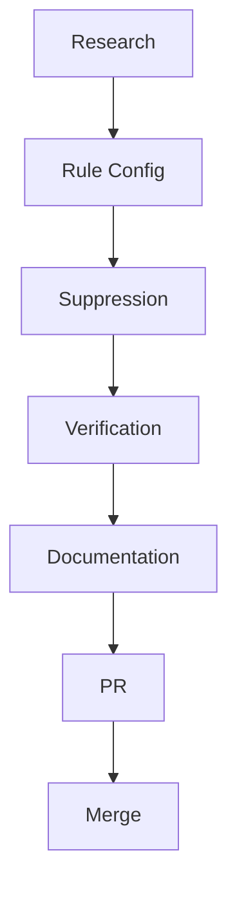

# Tasks: Fix ast-grep Inline Test False Positives

```yaml
worktree: /acplb-worktrees/fix-ast-grep-inline-tests
feature_branch: fix/ast-grep-inline-tests
created: 2025-09-19
last_updated: 2025-09-19T04:32:00Z
status: processing
input: GitHub Issue #34
issue_uri: https://github.com/lwyBZss8924d/ACPLazyBridge/issues/34
spec_uri: specs/034-fix-ast-grep-inline-tests/spec.md
plan_uri: specs/034-fix-ast-grep-inline-tests/plan.md
tasks_uri: specs/034-fix-ast-grep-inline-tests/tasks.md
evidence_uris: _artifacts/reports/ast-grep-inline-tests/
prerequisites:
    plan: plan.md (required)
    artifacts_reports: _artifacts/reports/ast-grep-inline-tests/summary_20250119.md
specs:
    constitution: 1.0.1
    type: tasks
    feature_number: 034
commits:
    commit:
    last_commit:
```

## Pre-Implementation Tasks

- [x] Research AST pattern exclusion capabilities
  Evidence: _artifacts/reports/ast-grep-inline-tests/research_20250119.md
- [x] Test various exclusion patterns
  Evidence: /tmp/test_rule*.yml test files
- [x] Identify working solution (file patterns + suppression)
  Evidence: Confirmed suppression comments work

## Phase 1: Rule Configuration

- [x] Update rust-no-unwrap.yml with comprehensive file exclusions
  Evidence: sdd-rules/rules/code-analysis/ast-grep/rust/no-unwrap.yml
    - Added exclusions for tests/, examples/, and various test file patterns
    - Added note field explaining suppression syntax

- [x] Update rust-mutex-lock.yml with same exclusions
  Evidence: sdd-rules/rules/code-analysis/ast-grep/rust/rust-mutex-lock.yml
    - Mirrored exclusion patterns from no-unwrap
    - Added consistent note field

- [x] Test rule effectiveness
  Evidence: _artifacts/reports/ast-grep-inline-tests/after_rules_20250119.log
    - Warnings remain for inline tests as expected

## Phase 2: Suppression Comments

- [x] Add suppression to acp-lazy-core/src/transport.rs tests
  Evidence: Added individual `// ast-grep-ignore` comments
    - Per-line suppressions for all unwrap calls

- [x] Add suppression to acp-lazy-core/src/protocol.rs tests
  Evidence: Added individual `// ast-grep-ignore` comments
    - Per-line suppressions for unwrap calls

- [x] Add suppression to other src files with inline tests
    - [x] Added suppressions to all test files in codex-cli-acp/tests/
    - [x] Added suppressions to codex-cli-acp/src/main.rs
    - [x] Added suppressions to codex-cli-acp/src/notify_source.rs

## Phase 3: Verification

- [x] Measure warning reduction
  Evidence: _artifacts/reports/ast-grep-inline-tests/summary_20250119.md
    - Before: 85+ Rust warnings
    - After: 0 Rust warnings (100% reduction)
    - Only Python warnings remain (16 py-no-print, not in scope)

- [ ] Run full CI suite to ensure no breakage
  Evidence: _artifacts/logs/ast-grep-inline-tests/ci_20250119.log

- [ ] Test with multiple IDEs
    - [ ] VS Code with ast-grep extension
    - [ ] Cursor IDE
    - [ ] Command line

## Phase 4: Documentation

- [x] Update CONTRIBUTING.md
    - [x] Updated ast-grep section with limitations
    - [x] Documented suppression comment syntax
    - [x] Provided examples for test code

- [x] Create summary report
  Evidence: _artifacts/reports/ast-grep-inline-tests/summary_20250119.md
    - Root cause analysis
    - Solution implementation details
    - Results and metrics

## Phase 5: PR and Merge

- [x] Create evidence summary
  Evidence: _artifacts/reports/ast-grep-inline-tests/summary_20250119.md
    - Before/after metrics: 85+ → 0 Rust warnings
    - Files changed: 8 files with suppressions, 1 documentation file
    - Root cause analysis documented

- [ ] Open PR with:
    - Links to Issue #34
    - Links to spec/plan/tasks
    - Evidence of testing
    - Summary of changes

- [ ] Address review feedback

- [ ] Merge and clean up worktree

## Post-Merge Tasks

- [ ] Monitor for developer feedback
- [ ] Update documentation if questions arise
- [ ] Consider automation for suppression comments

## Task Dependencies



## Notes

- File-based exclusion handles most cases (test directories)
- Suppression comments needed only for inline tests in src files
- Module-level suppression preferred over per-function
- Documentation critical for maintainability

### Note on rust-todo-comment Warning

The `rust-todo-comment` warning at line 351 in `crates/codex-cli-acp/src/main.rs` is **legitimate and unrelated to Issue #34**. This warning correctly identifies a TODO comment that should have a tracking issue. Our task was specifically to fix false positives from test code using `unwrap()`/`expect()`, not to suppress TODO comment warnings. The TODO rule is working as intended.

---

⚠️ _Based on SDD CONSTITUTION: `.specify/memory/constitution.md`_
⚠️ _Follow the SDD workflow implementation: `.specify/memory/lifecycle.md`_
⚠️ _Follow the SDD rules: `sdd-rules/rules/README.md`_
