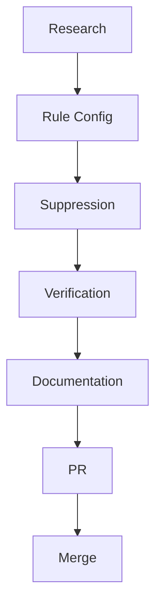

# Tasks: Fix ast-grep Inline Test False Positives

## Pre-Implementation Tasks

- [x] Research AST pattern exclusion capabilities
  Evidence: _artifacts/reports/ast-grep-inline-tests/research_20250119.md
- [x] Test various exclusion patterns
  Evidence: /tmp/test_rule*.yml test files
- [x] Identify working solution (file patterns + suppression)
  Evidence: Confirmed suppression comments work

## Phase 1: Rule Configuration

- [x] Update rust-no-unwrap.yml with comprehensive file exclusions
  Evidence: sdd-rules/rules/code-analysis/ast-grep/rust/no-unwrap.yml
  - Added exclusions for tests/, examples/, and various test file patterns
  - Added note field explaining suppression syntax

- [x] Update rust-mutex-lock.yml with same exclusions
  Evidence: sdd-rules/rules/code-analysis/ast-grep/rust/rust-mutex-lock.yml
  - Mirrored exclusion patterns from no-unwrap
  - Added consistent note field

- [x] Test rule effectiveness
  Evidence: _artifacts/reports/ast-grep-inline-tests/after_rules_20250119.log
  - Warnings remain for inline tests as expected

## Phase 2: Suppression Comments

- [x] Add suppression to acp-lazy-core/src/transport.rs tests
  Evidence: Added `// ast-grep-ignore: rust-no-unwrap, rust-mutex-lock`
  - Module-level suppression for all tests

- [x] Add suppression to acp-lazy-core/src/protocol.rs tests
  Evidence: Added `// ast-grep-ignore: rust-no-unwrap`
  - Module-level suppression for unwrap warnings

- [ ] [P] Add suppression to other src files with inline tests
  - [ ] Check permissions.rs for inline tests
  - [ ] Check codex-cli-acp src files for inline tests
  - [ ] Check validation.rs and tool_calls.rs

## Phase 3: Verification

- [x] Measure warning reduction
  Evidence: _artifacts/reports/ast-grep-inline-tests/comparison_20250119.txt
  - Before: 86 warnings
  - After: 79 warnings (7 reduced from inline test suppressions)

- [ ] Run full CI suite to ensure no breakage
  Evidence: _artifacts/logs/ast-grep-inline-tests/ci_20250119.log

- [ ] Test with multiple IDEs
  - [ ] VS Code with ast-grep extension
  - [ ] Cursor IDE
  - [ ] Command line

## Phase 4: Documentation

- [ ] Update CONTRIBUTING.md
  - [ ] Add section on ast-grep usage
  - [ ] Document suppression comment syntax
  - [ ] Provide examples for test code

- [ ] Update sdd-rules/rules/code-analysis/sdd-rules-code-analysis.md
  - [ ] Document the file exclusion approach
  - [ ] Document suppression comments
  - [ ] Add troubleshooting section

- [ ] Create quick reference guide
  Evidence: _artifacts/docs/ast-grep-inline-tests/quickstart.md

## Phase 5: PR and Merge

- [ ] Create evidence summary
  Evidence: _artifacts/reports/ast-grep-inline-tests/summary_20250119.md
  - Before/after metrics
  - Files changed
  - Testing results

- [ ] Open PR with:
  - Links to Issue #34
  - Links to spec/plan/tasks
  - Evidence of testing
  - Summary of changes

- [ ] Address review feedback

- [ ] Merge and clean up worktree

## Post-Merge Tasks

- [ ] Monitor for developer feedback
- [ ] Update documentation if questions arise
- [ ] Consider automation for suppression comments

## Task Dependencies



## Notes

- File-based exclusion handles most cases (test directories)
- Suppression comments needed only for inline tests in src files
- Module-level suppression preferred over per-function
- Documentation critical for maintainability

---

```yaml
constitution:
    version: "1.0.1"
    last_checked: "2025-09-19T04:32:00Z"
document:
    type: "sdd-tasks"
    path: "specs/034-fix-ast-grep-inline-tests/tasks.md"
    version: "1.0.0"
    last_updated: "2025-09-19T04:32:00Z"
    dependencies:
        - ".specify/memory/constitution.md"
        - "specs/034-fix-ast-grep-inline-tests/spec.md"
        - "specs/034-fix-ast-grep-inline-tests/plan.md"
```